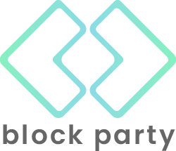

<!-- PROJECT LOGO -->
 

  

  <h3 align="center">block party</h3>
  

    Community Board Meeting Minutes - NLP & Civic Tech
     
    <i>A public written record of meeting transcript and summary</i>
     
    Sarah Sachs and Brandon Pachucua
     
    <a href="https://github.com/othneildrew/Best-README-Template"><strong>Explore the docs »</strong></a>
     
     
    <a href="https://github.com/othneildrew/Best-README-Template">Medium Article</a>
    ·
    <a href="https://github.com/othneildrew/Best-README-Template/issues">Report Bug</a>
    ·
    <a href="https://github.com/othneildrew/Best-README-Template/issues">Request Feature</a>
  

<!-- TABLE OF CONTENTS -->
## Table of Contents

* [About the Project](#about-the-project)
  * [Built With](#built-with)
* [Getting Started](#getting-started)
  * [Prerequisites](#prerequisites)
  * [Installation](#installation)
* [Usage](#usage)
* [License](#license)
* [Contact](#contact)
* [Acknowledgements](#acknowledgements)

<!-- ABOUT THE PROJECT -->
## About The Project

block party makes local policy information accessible and byte-sized, with a weekly email of your community board’s most recent meeting synopsis and transcript data. 

block party generates summarizations of community board meetings directly from transcript data collected from YouTube.

Here's How:
* Collect closed captions from YouTube recordings of community board meetings
* Clean text and add grammar
* Extract key content and automatically generate summary

### Citations:

1. Pull Transcript from Youtube

    https://pypi.org/project/youtube-transcript-api/

2. Add Punctuation and grammar

    https://pypi.org/project/punctuator/

    <strong>Punctuator Model</strong>

    Ottokar Tilk and Tanel Alum{\"a}e},
    Bidirectional Recurrent Neural Network with Attention Mechanism for Punctuation Restoration,
    Interspeech 2016

3. Extract key content
    
    Honnibal, M., & Montani, I. (2017). spaCy 2: Natural language understanding with Bloom embeddings, convolutional neural networks and incremental parsing.

4. Summarize Text
    https://radimrehurek.com/gensim/summarization/summariser.html
